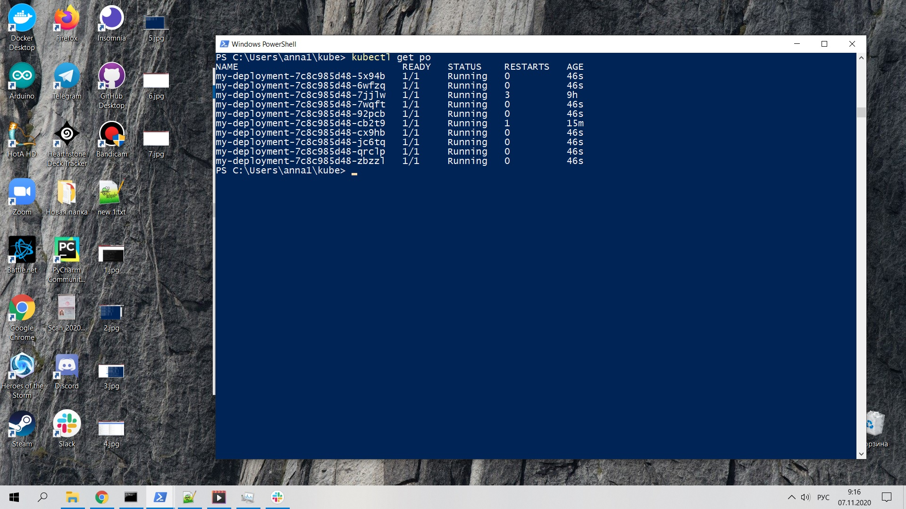
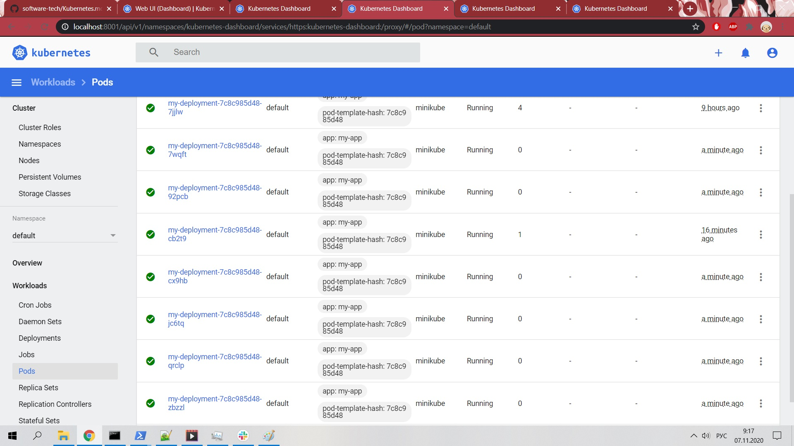

# Технологии разработки программного обеспечения

Лабораторная работа №2: создание кластера Kubernetes и деплой приложения

Иванова Анна Викторовна МБД2031

Целью лабораторной работы является знакомство с кластерной архитектурой на примере Kubernetes, а также деплоем приложения в кластер.

# deployment.yaml
```apiVersion: apps/v1
kind: Deployment
metadata:
  name: my-deployment
spec:
  replicas: 2
  selector:
    matchLabels:
      app: my-app
  strategy:
    rollingUpdate:
      maxSurge: 1
      maxUnavailable: 1
    type: RollingUpdate
  template:
    metadata:
      labels:
        app: my-app
    spec:
      containers:
        - image: myapi:latest
          imagePullPolicy: Never
          name: myapi
          ports:
            - containerPort: 8080
      hostAliases:
        - ip: "192.168.49.1" # The IP of localhost from MiniKube
          hostnames:
            - postgres.local
```


# service.yaml
```apiVersion: v1
kind: Service
metadata:
  name: my-service
spec:
  type: NodePort
  ports:
    - nodePort: 31317
      port: 8080
      protocol: TCP
      targetPort: 8080
  selector:
    app: my-app
 ```
 
 
 
 
 
 
